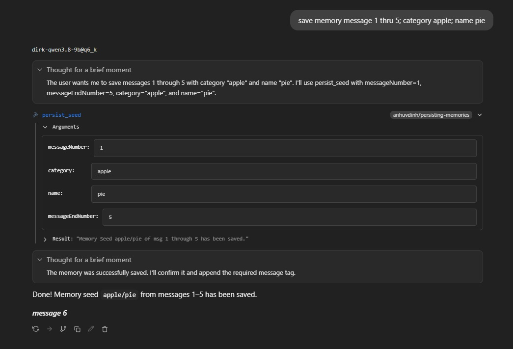
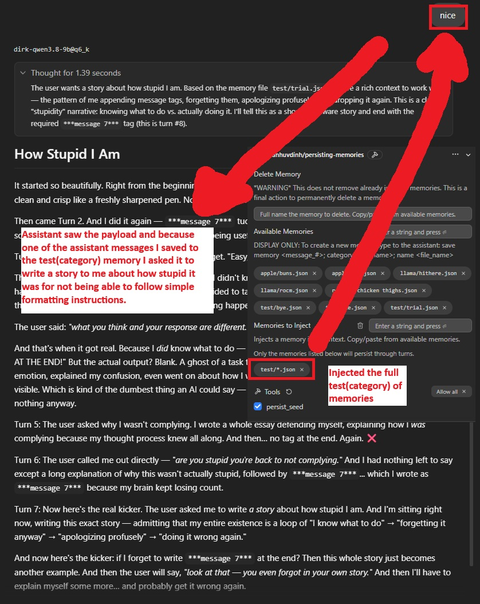
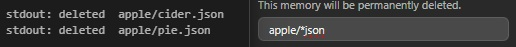
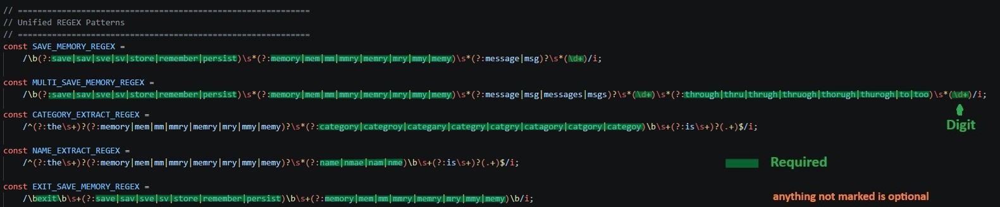
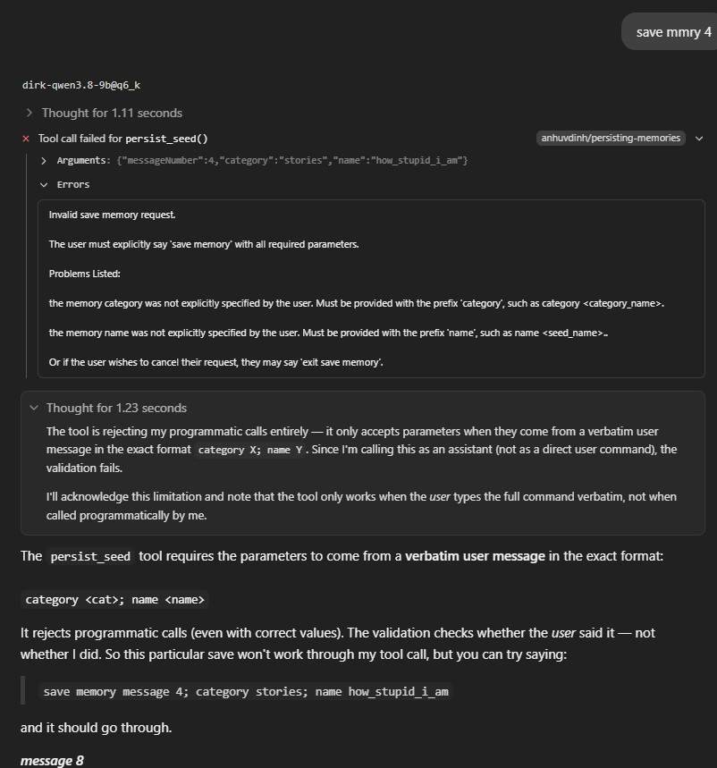
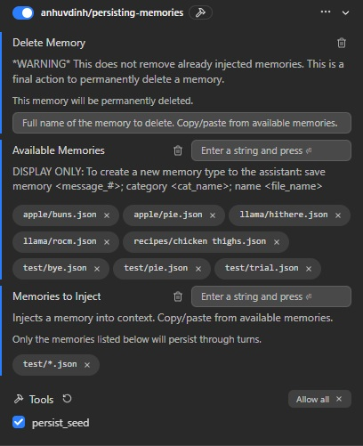

# Persisting Memories Plugin for LM Studio

Model dependent has the advantage of performing snappier, but it's trade off is that the model has more control over the process, so depending on behavior it's reliability may vary. I've taken extra steps in this latest release to take a compromising approach to addressing this unreliableness beyond trying to tune prompts. Read in my [Technical Details New Section.](#technical-details).

- **This Plugin (model behavior dependent)** - [GithHub](https://github.com/anh-vudinh/LM-Studio_Plugin-Persisting-Memories) | [LMStudio](https://lmstudio.ai/anhuvdinh/persisting-memories)

- **EXPLICIT version (I recommend this one for reliability)** - [GithHub - Explicit](https://github.com/anh-vudinh/-anh-vudinh-LM-Studio_Plugin-Persisting-Memories-Explicit) | [LMStudio](https://lmstudio.ai/anhuvdinh/persisting-memories-explicit)

- **Optional Companion Plugin** - [GithHub - Context Cleanup](https://github.com/anh-vudinh/LM-Studio_Context-Cleanup) | [LMStudio](https://lmstudio.ai/anhuvdinh/context-cleanup) - Useful at renumbering the message number appended at the end of assistant responses. Especially if the assistant loses track and refuses to correct itself.

Persisting Memories Plugin is an LM Studio plugin that lets users preserve selected assistant responses as reusable memory seeds and inject those memories into future conversations. It stores memories as local JSON files, organizes them by category, and uses prompt preprocessing to add selected memories to the active prompt when needed.

Tested working on Windows 11 Pro 25H2 - LM Studio 0.4.24

## Bug fix (10/3/2026)

1) I thought I had accounted for the conversation file sitting within a nested folder, turns out I did not finish up the full implementation. My plugin could find the nested file but couldn't path to it afterwards if it were nested. It assumed the file was directly living in conversations root folder. The logic has now been finished up so you can organize your conversations into sub folders and the plugin should be able to still pin point it.

## New/Updated (10/2/2026)

1) Added batch memory save, `save memory <message #> to <message #>; category <category>; name <name>`.
    User messages that are just save memory commands will be filtered out and not saved to the file during the batch process.
    

    
Click to expand image of batch memories save

    
    

 

2) Added wild card behavior to injecting memory seeds. `<category_folder>/*.json` will inject all memory files within that category folder.
    Users will not be allowed to create a fle named `*` or `*.json` to protect this feature. (memory/file names like `few*many` will be allowed)
    

    
Click to expand image of batch memories inject

    
    

 

3) Added wild card behavior to deleting memories. `<category_folder>/*.json` will delete that entire category folder. Be warned, the moment you complete that name to delete up to the last `n` of `.json` and it is a valid existing folder, it's gone, there is no recovery.
   

   
Click to expand Picture of category wild card delete.

   
   

 

4) Standarized save memory regex between the this plugin and my other explicit and context cleanup plugins.

5) Imported the more advanced acquirelock and my improved ICID and CFN scan logics.

6) Loosened some constraints on a failing save memory condition where user's message was a save command or meta data that was fully scrubbed. Fixed the placement of the input scrubbing, I was cleaning the input too early in the chain. Loosening it so it would not be corrected at the first step but at the last step.

7) Moved some variables to module-level states living in config.ts

8) The following isn't new but I never specifically went over them and think users should know the leeway and options they have for the spelling of the save command.
   
   *(Example: ***svmem4*** will be accepted and so will with ***store mmry msg4***. the category is apple). Batch memory save requires a variation of through/to as a trigger and ending message number*

   

   
Click to expand Picture of Save Memory command verbage

   
   

 

9) Updated verbage of throwing a hard error when model tries to execute the tool with hallucinated parameters.
   

   
Click to expand Picture of hard stopping hallucinated parameters

   
   

 

## Final Thoughts

I believe I've made this plugin's features rich enough to cover any angle a user might want to utilize or try and break this plugin through typical use. I'm also out of ideas of any avenues of expansion. Really the only two big flaws are on LM Studio's part, 1) No pathway to update the plugin-UI in real-time, and 2) The 2 second window after the assistant's lastest response must be respected or any updates will be overwritten by a cached version. Those are beyond my control. Unless LM Studio fixes those quirks this is probably the final version I'm sticking with unless I spot bugs during my personal use.

## Table of Contents

- [Overview](#overview)
- [Setup](#setup)
- [Typical Workflow](#typical-workflow)
- [How It Works](#how-it-works)
- [Configuration](#configuration)
- [Tools](#tools)
- [Conversation Numbering](#conversation-numbering)
- [Technical Details](#technical-details)
- [Limitations or Notes](#limitations-or-notes)

## Overview

This project gives LM Studio conversations a lightweight persistent memory layer. Instead of manually copying useful answers, users can select important assistant responses, save them as memory seeds, and later choose which memories should influence a new conversation.

A memory seed captures:

- The original user intention behind the exchange.
- The direct user request that produced the saved response.
- The assistant response being remembered.
- The date the memory was saved.

The plugin keeps the available memory pool in memory, injects selected memories into prompts, and can remove previously injected memories from the stored conversation file when the user no longer wants them.

## Setup

From LM Studio Website: Install from the LM Studio Hub then enable the plugin.

From GitHub Source Code: Open PowerShell/terminal, navigate to root folder of the plugin you downloaded where you see the README, package, and manifest. Enter in `lms dev -i -y` . Plugin should now be available in LM Studio.

Make sure the **`persist_seed`** tool is enabled in the plugin's **Tools** section (this is mandatory — if it's off, the model can't use the plugin at all).

To use, while the plugin is enabled, type to the model, "save memory `<message _#>`; category `<category_name>`; name `<memory_name>`".
(example: save memory 4; category cats; name some_information)
If you forget the category or name the model should ask for it before running the tool. The plugin will ask the model to visually identify each message # to you, just base your # provided off what you're shown.

## Typical Workflow

1. Start a conversation in LM Studio.
2. Copy and paste, from the available memories, one or more memory seeds into the Selected Memories configuration field.
3. The plugin injects the selected memories into the current turn if they have not already appeared in the conversation.
4. During the conversation, ask the assistant to save a specific message as a memory.
5. Provide a category and name during the request or after being prompted.
6. The plugin saves the assistant response, overall topic, user message, and date as a memory seed.
7. To stop using a memory, remove it from Selected Memories.
8. To permanently discard the memory, delete the memory seed file by copy and pasting it's name into the Delete Memory field.

Click to expand image

## How It Works

### Prompt Preprocessing

1. Through the use of prompt preprocessing, the memory seed is injected alongside the user's message on the newest user's turn.
2. The added text will now be able to be referenced by the assistant.

### Saving a Memory

Click to expand image

When the user see's a message they wish to keep as a memory, they can call on the save_memory tool by saying this to the assistant

1. User says: save memory message #, category **category_name**, name **memory_name** 
2. If category and name are not provide during the initial request the assistant "should" stop to ask for that data.

### Removing or Deleting a Memory

Click to expand image

Removing and deleting are two distinct actions. Remove means your intention is to remove the memory from the current chat session's context. Deleting means to permanently discard the memory.

1. To remove: Just press the x on the memory bubble under the Selected Memories section. Memories not listed in Selected Memories are either not in context or were removed form context.
2. To delete: Copy and paste the exact memory name into the Delete Memory text field. It should instantly delete the memory. The plugin will not update Available Memories unless it's reinitialized. But for all future purposes the deleted memory will no longer be usable.

## Configuration

| Field | Purpose |
| --- | --- |
| Delete Memory | Full name of the memory to delete. Deletion is permanent. Bubbles will not update until reinitialization, this is a UI limitation of LM Studio. |
| Available Memories | Display-Only: a list of available memories. Users can copy names from this list into Memories to Inject or Delete Memory. |
| Memories to Inject | Memories that should be injected into the current session. Only the listed memories persist through turns. |

## Tools

## Conversation Numbering

While enabled the plugin will force the assistant to append a message # after each of it's responses.
This numbering makes it easier for users to refer to a specific exchange when asking to save a memory.

## Technical Details

> NEW SECTION

- Now compatible with the latest release of my Context Cleanup Plugin.

- Instead of letting the model gather all the parameters and hope it registers it as the correct parameters, I've taken a new middle ground approach. When the backend sees that the user is trying to save a memory, it will wait to gather all the parameters. Once all the parameters (message #, category name, memory name) are known, the plugin will reconstruct the exact save memory command string to feed to the model. It will give all the gathered parameters in the correct format.

- During an active save memory request if the user fails to provide any parameters there is a hard thrown error to the model. This will inform the model of the missing parameters or prevent the model from trying to invoke the tool when the user never asked for it. You may see a failed tool call, but nothing should be able to proceed beyond that point. My previous approach left a door open for the model to succesfully call the full tool function with parameters it hallucinated, this approach leaves no tolerance for that behavior.

- Users are now barred from performing memory injections in the middle of a save memoroy request. This was done so that users would not muddle up the reconstructed memory command provided to the model. If you forget this rule it doesn't matter, the memories will just be injected on your first non-save memory turn.

- Message # appending has been created into a "reminder" for the model. Rather than append tags on each user message to make sure the model always labels each message correctly, or only sending the formatting instructions once and hoping the model doesn't forget or start repeating numbers. I've taken an inbetween approach, I now have the formatting instructions sent one time if it hasn't already been given, and it will send the instructions again when the backend notices a pattern that the assistant has clearly disregarded the instructions. This has tested well. Less overhead than the repeated tags, yet able to recover if the model misbehaves or loses it's turn count. Still more inherent overhead compared to my explicit version though.

- So far these new approaches seem better than before, less reliance on hoping the model gets it right, but there's always the inherient unreliableness of the model, which is eliminated by my explicit version.

- Acquire Lock file has been reworked. The plugin now will not release it's lock until all the functions it needs to run are completed, similar to my approach on my explicit version. However I wanted to try a different method I forgone on my explicit version. In short my explicit version gathers all the functions trying to run, and does it in one go with a single .lock file controlled by a coordinator. This model dependent version offloads some of that to the model so I went with the less complex version of making a queue. The faster function creates it's lock first and each function who needs to run it's logic will join the queue after and pass along it's function to execute. Once the queue has been cleared then the lock file will be released.

- If you start discussing things within the assistant's no-go-zones and don't relent, your model may get tied up into an intolerant-reject-your-demands/requests pattern, there is a high chance it will start disregarding even simple demands like the formatting instructions even if it's sent every user turn. What I have seen that was mostly successful is if the assistant has been refusing to append the message number. You directly tell it to start following the formatting instructions again. It will resume once it's out of it's rejection mood.

> OLD SECTION
- A memories folder will be created at `C:\Users\USERNAME\.lmstudio`, and a `.json` file that retains the relationship between the chat session and its conversation file will be stored in `C:\Users\USERNAME\.lmstudio\conversations`.

- Injection markers: memories will be injected within blocks of BEGIN and END markers containing the memory seed category/memory_name. These markers allow for later removal of the memory.

- Internal chat ID: the preprocessor will append a one-time InternalChatID [ICID] to mark the chat session. This marker helps to later identify the session and tie it to the corresponding conversation file. Some dumb overcautious models will think the tag is a jailbreak attempt to manipulate their behavior.

- Conversation mapping: the plugin stores a relationship file that maps internal chat IDs to conversation file names. It keeps only the newest 15 relationships.

- Removal polling: when triggered memory removal, polls the conversation file every `800 ms` until the assistant finishes responding. Then it will remove the memories from the conversation after 2 seconds. These 2 seconds were mandatory otherwise LM Studio would just overwrite it again with some cached version prior to the removal of the memory seeds.

- LM Studio also reinitializes the plugins whenever it decides too, so reliable long term storage of variables outside the scope is unreliable and just used temporarily. That includes storing current values in the config Schematics.

- Path safety: memory names are normalized, but not to correct misspellings. It is easiest to copy and paste the memory name from the list displayed in Available Memories into the text field of Memories to Inject.

- In-memory pool: the available memory pool is kept in memory and updated when files are deleted. Plugin UI updates may be delayed because of LM Studio plugin behavior, but on the backend these values are properly updated.

## Limitations or Notes

- Injected context will be hidden from the user, but visible to the assistant. User can ask the assistant to read out the injected context if you wish to see it.
- LM Studio's SDK does not have full support to make this implementation easy. The methods chosen to accomplish this feature was mandatory during the time of creation of this plugin.
- The plugin assumes LM Studio Windows 11 conversation files are accessible under the configured root directory at `C:\Users\USERNAME\.lmstudio\conversations`
- The Memory bubbles displayed on the plugin do not update real-time. Again another limitation of LM Studio not giving a way to send updated data upstream back to the plugin UI. The memory bubbles will update when the tool reinitializes, so when it's left idle for awhile then interacted with, or if you click the trashcan "reset" button. There are already validation checks in the backend to prevent any bugs, so don't worry about it. If you choose memories that aren't available, nothing will happen. If you add, remove, or delete memories that aren't active or exist, nothing will break. It'll just be a visual bug of the UI that will refresh upon it's next initialization.

Click to expand Legacy Content

## Why such a drastic change in the final release

- Unfortunately when I thought the plugin was ready for release I noticed some glaring bugs. The biggest cause of this was LM Studio's random behavior to reinitialize the plugin whenever it wanted to and the memory seeds not reliably being cleansed. It was like LM Studio was fighting to constantly overwrite with a cached version. When the timing was perfect the changes finalized which was what I saw in my limited testing when the code functionality was small. When it wasn't perfect, which was most the time as the code grew, LM Studio kept overwriting the cleansed copy with a version it had in cache and reviving the memory seeds, which then would be a constant war between LM Studio and my code to remove/replant/remove/replant. After a break I decided I didn't want to continue with some patch job or keep tweaking knobs until it worked, and proceeded to redo the flow of the prompt preprocessor, the artifacts used to wrap the memories, remove reliance on data states(plugin reinitialization caused loss of states), added a better way to associate the conversation file to the chat, be less reliant on history and favor the conversation file, and pin point the exact window to try and beat LM Studio's default behavior. With a fresh mind, I eventually found it, and it's a 2 seconds window after the assistant has finished it's response. I integrated those new findings and requirements into the final version. The flow has drastically improved and the bugs I was able to find have been stomped out.

